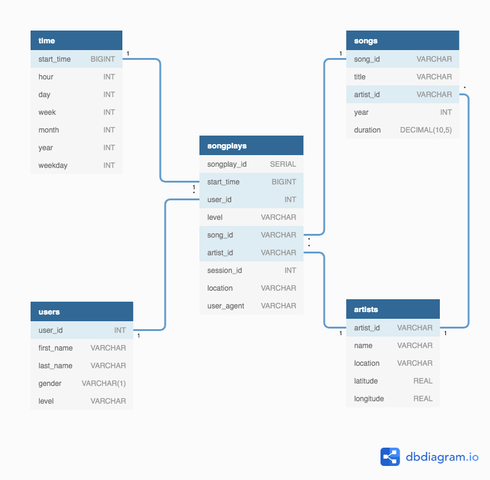

# Udacity Project: Data Warehouse

Load song and event data from the "Sparkify" music application logs into an Amazon Redshift database for analytics processing.

# Extensions Beyond the Curriculum

## Infrastructure as Code

We use Terraform to manage the creation of the Redshift cluster in AWS. This includes:

- Use of KMS secrets to encrypt DB credentials in .tf files
- Remote state stored in S3, KMS encrypted to avoid leaking secrets
- All required IAM Role and Policies are also managed in Terraform

# Quickstart

Copy `dwh.cfg.example` to `dwh.config` and fill in details for your Redshift cluster. Note that the IAM Role supplied needs Read access to S3.

Run `create_tables.py` to clean up any existing tables and create new tables.

Run `etl.py` to perform the full ETL process.

# Design

`songplays` is chosen as the central fact table, representing individual `NextSong` requests from the application logs. `users`, `songs` and `artists` are straightforwards choices for dimension tables, and `times` pre-computes a breakdown of play times for faster analysis over time periods of various granularities.

## Keying considerations

For the `songs` and `artists` table we choose a common distribution key of `artist_id` to prevent shuffling for what is expected to be the common operation of joining Songs to Artists. By using `songplays.artist_id` as a further distribution key, we optimise for queries on usage statistics for particular artists play counts. Should there be additional specification on the types of queries that would be made, this would need to be optimized differently.

For sorting keys, we use `songplays.start_time`, anticipating that start time is the most likely column to be ordered by.

# ETL process notes

The tables `staging_songs` and `staging_events` provide a staging area in the Redshift DB into which raw data is loaded from S3. We use the `COPY` command for Redshift, which allows a parallel load from S3 and acceleration of the load process if there are more nodes in the cluster.

We use `INSERT INTO ... SELECT FROM ...` statements to transform data from the staging tables into the final fact and dimension tables. This again allows for parallelisation. Note that for the `users` table, we are careful to import the most recently observed user attributes from the event log.

Songs from the event logs are matched to the Million Songs Database by an exact string comparison of Artist and Song Title, along with matching the song duration to the nearest second.
